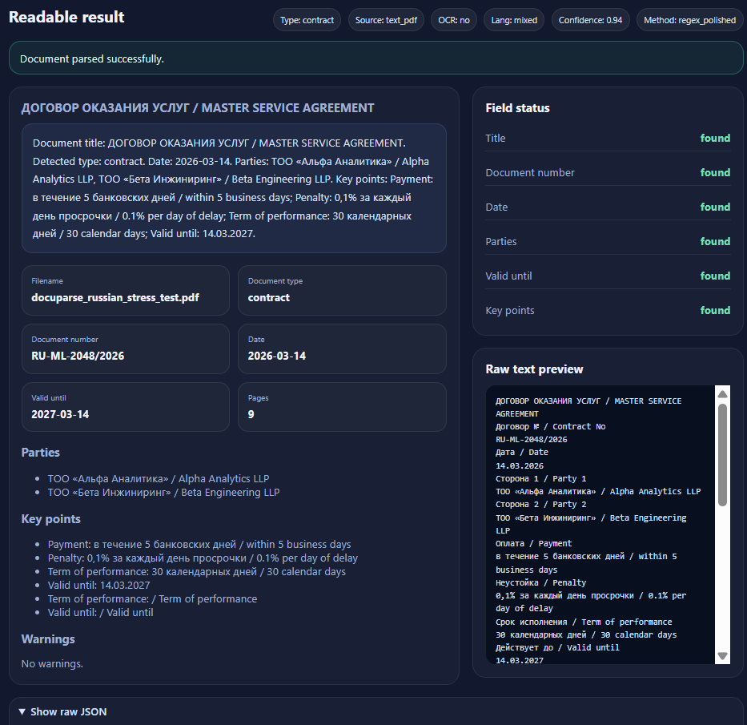
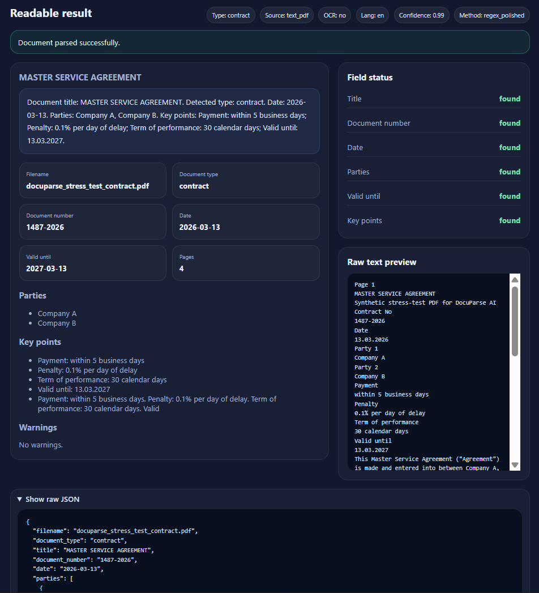
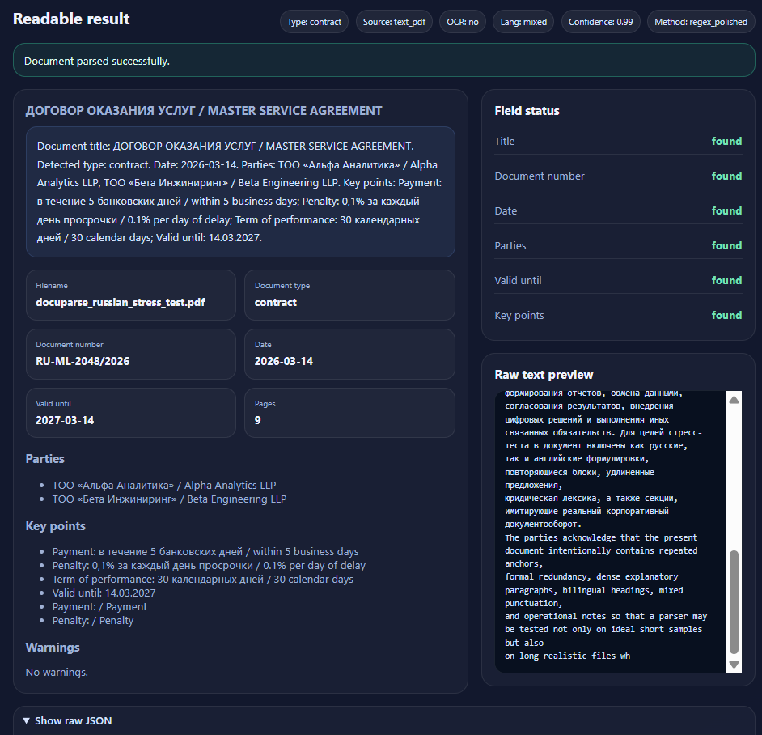

# DocuParse AI Showcase

DocuParse AI Showcase is a PyCharm-ready FastAPI project for parsing PDF documents, applying OCR to scanned files, extracting structured fields, and presenting the result in a readable browser report instead of dumping raw JSON like it is still 2017.

## Why this project matters

This showcase demonstrates practical competence in:

- PDF parsing
- OCR fallback for scanned files
- structured field extraction
- mixed-language document handling
- readable result visualization
- backend API design for document intelligence workflows

The same engineering approach can be adapted for LegalTech scenarios involving court decisions, regulations, policies, and other formal documents.

## Core capabilities

- upload a PDF through browser UI or API
- detect **text PDF** vs **scanned PDF**
- extract text with **PyMuPDF**
- fallback to **Tesseract OCR** for scans
- normalize noisy text
- extract:
  - title
  - document number
  - date
  - parties
  - valid until
  - key points
- show a readable result with:
  - field status
  - warnings
  - raw text preview
- expose the same result through `POST /parse-pdf`

## Tech stack

- Python 3.11+
- FastAPI
- Uvicorn
- PyMuPDF
- Tesseract OCR via pytesseract
- Pillow
- Pydantic
- HTML / CSS / JavaScript
- OpenAI Python SDK (optional)

## Recommended IDE

Use **PyCharm**. It saves time and reduces the amount of pointless path drama that Windows and random terminal setups love to generate.

## Screenshots

### Mixed-language document parsing


### English contract parsing


### Stress-test contract parsing


## Project structure

```text
app/
  api/routes/parse.py        # health, parse, sample list endpoints
  core/config.py             # .env settings
  schemas/document.py        # response models
  services/
    cleaner.py               # text normalization
    detector.py              # text PDF vs scanned PDF detection
    extractor.py             # rule-based extraction logic
    ocr_reader.py            # OCR fallback with Tesseract
    openai_service.py        # optional GPT-4o enrichment
    parser_service.py        # orchestration layer
    pdf_reader.py            # direct text extraction
  static/
    index.html               # browser demo UI
    style.css                # visual styling
    app.js                   # frontend logic
    favicon.png              # favicon
  main.py                    # FastAPI entrypoint

data/
  samples/                   # bundled demo PDFs
  temp/                      # temporary uploads

docs/
  screenshots/               # prepared screenshots for presentation
  GITHUB_DESCRIPTION.md      # short GitHub repo description
  SCREENSHOTS_GUIDE.md       # screenshot usage guide

tests/
  test_health.py             # smoke test
```

## Bundled sample files

The project includes these demo PDFs in `data/samples/`:

- `sample_contract.pdf`
- `sample_policy.pdf`
- `sample_tender_spec.pdf`
- `sample_scanned_contract.pdf`
- `sample_long_contract_stress.pdf`

## How to run

### 1. Open the project in PyCharm
Open the project folder directly.

### 2. Create or select a Python interpreter
Recommended:
- Python 3.11 or 3.12

### 3. Install dependencies

```bash
pip install -r requirements.txt
```

### 4. Create `.env`

PowerShell:

```powershell
Copy-Item .env.example .env
```

### 5. Configure OCR

If you want scanned PDFs to work, install Tesseract and set:

```env
TESSERACT_CMD=C:\Program Files\Tesseract-OCR\tesseract.exe
```

### 6. Start the app

```bash
uvicorn app.main:app --reload
```

### 7. Open the interfaces

- Browser UI: `http://127.0.0.1:8000/`
- Swagger UI: `http://127.0.0.1:8000/docs`

## Main endpoints

### `GET /health`
Basic health check.

### `GET /samples`
Returns bundled sample files.

### `POST /parse-pdf`
Accepts a PDF and returns structured extraction output.

## Demo flow for presentation

1. Open `/`
2. Show the upload panel and sample files
3. Parse `sample_contract.pdf`
4. Parse `sample_long_contract_stress.pdf`
5. Parse a Russian or mixed-language sample
6. Show:
   - readable result
   - field status
   - warnings
   - raw text preview
7. Open `/docs` briefly to demonstrate the API layer

## OCR and language notes

### What already works well

- text PDFs in English
- text PDFs in Russian
- mixed Russian/English formal documents
- long multi-page documents with repeated anchor fields

### Where the system is still weaker

- bad scans with poor contrast
- documents with no clear anchor fields
- non-standard layouts with floating tables or rotated pages
- deeply domain-specific clauses without explicit labels

For Russian scanned PDFs, make sure your Tesseract installation includes the `rus` language pack.

## Optional OpenAI enrichment

Enable it in `.env`:

```env
ENABLE_AI_ENRICHMENT=true
OPENAI_API_KEY=your_openai_api_key_here
OPENAI_MODEL=gpt-4o
```

Important: the correct model name is **gpt-4o** with the letter **o**, not zero.

## What this project proves

This project demonstrates:

- document ingestion
- PDF parsing
- OCR fallback
- structured field extraction
- readable reporting UI
- support for long and mixed-language files

That makes it a strong showcase for document intelligence, OCR, parsing pipelines, and pre-RAG processing.
